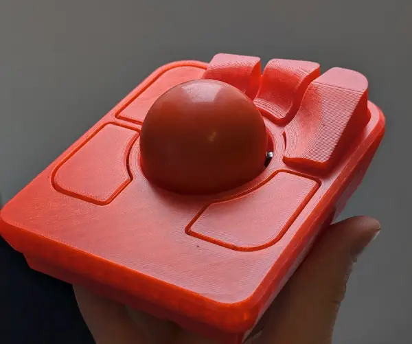
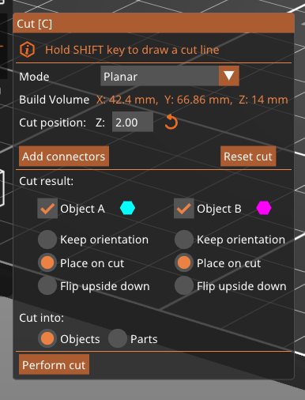
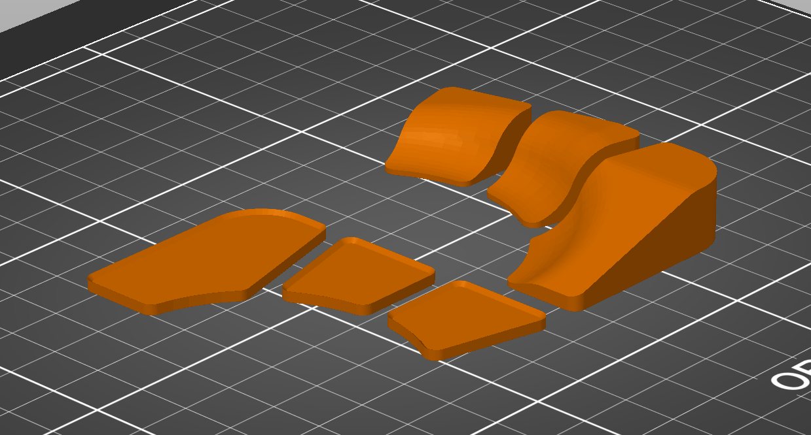

# Raised buttons for the [Ploopy Adept](https://ploopy.co/adept-trackball/)

My tiny hands struggle to reach the furthest 3 buttons from my natural resting position on the ploopy.

To solve this I created 3 raised buttons that are 3d-printable to be glued on top of the original ploopy case to raise the buttons into reach.

## How to use

1. Download the [.stl](./ploopy_adept_raised_buttons.stl) file and import it into your favourite slicer.

2. If you're right handed, flip the model

3. Because of the slight "lip" around the button to make it slot into the existing buttons, I recommend cutting the print in two, and gluing it after the print is done with superglue.

   I cut at 2mm, placing both pieces on the flat cut side:

   

   Looks like this:

   

4. Because of the curves, I print at 0.15mm layer height. But this is up to your. Print!

5. Glue together each of the cut pieces

6. Dry fit to make sure it looks good. I recommend testing if it works for you by either just resting them on the buttons for a few days, or doing a thin piece of double sided tape. If you're happy with it like me, superglue them in place!
